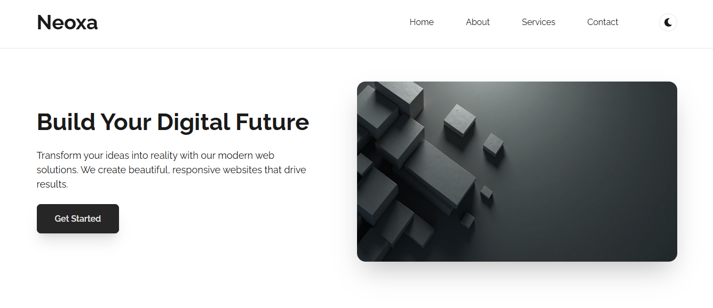

# Neoxa

A modern, responsive React landing page built with Vite and Tailwind CSS. Neoxa is a small single-page project showcasing a clean design, theme toggle, and reusable components for a simple company or product homepage.

## Screenshot



## Key Features

- Minimal, responsive layout for a modern landing page
- Theme toggle (light/dark) using a small custom hook
- Reusable components: Navbar, Hero, Services, About, Footer
- Built with Vite for fast dev server and Tailwind CSS for utility-first styling

## Technology Stack

- React (JSX)
- Vite
- Tailwind CSS
- Plain JavaScript (no TypeScript)

## Quick Start

1. Install dependencies

```bash
# from project root
npm install
```

2. Start the development server

```bash
npm run dev
```

3. Build for production

```bash
npm run build
```

4. Preview the production build locally

```bash
npm run preview
```

Note: These scripts assume standard Vite entries in `package.json`.

## Project Structure (high level)

- `index.html` — app entry
- `src/main.jsx` — React entry
- `src/App.jsx` — app root
- `src/components/` — UI components (Navbar, Hero, Services, About, Footer, ThemeToggle)
- `src/hooks/useTheme.js` — theme toggle hook
- `public/` — static assets
